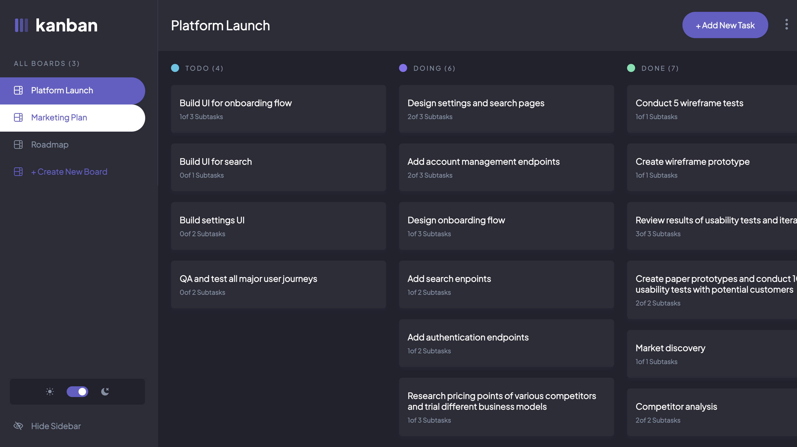

Live Site URL: [Live Site](https://mrfinesse47.github.io/kanban/)

## Table of contents

- [Overview](#overview)
  - [The challenge](#the-challenge)
  - [Screenshot](#screenshot)
  - [Links](#links)
- [My process](#my-process)
  - [Built with](#built-with)
  - [What I learned](#what-i-learned)
  - [Continued development](#continued-development)
  - [Useful resources](#useful-resources)
- [Author](#author)
- [Acknowledgments](#acknowledgments)

## Overview

The Kanban board is a tool for workflow visualization, designed to bring clarity to your work process, and enhance productivity by minimizing work in progress.

### The challenge

Users should be able to:

- View the optimal layout for the app depending on their device's screen size -- not completed yet
- See hover states for all interactive elements on the page -- not completed yet
- Create, read, update, and delete boards and tasks
- Receive form validations when trying to create/edit boards and tasks
- Mark subtasks as complete and move tasks between columns
- Hide/show the board sidebar
- Toggle the theme between light/dark modes
- Drag and drop tasks to change their status and re-order them in a column

### Screenshots

##### -The Main View


##### -The Main View With Sidebar Open



##### -The Main View With Sidebar Open Light Theming


##### - Add Task Menu Light


### Links

- Solution URL: [Add solution URL here](https://your-solution-url.com)
- Live Site URL: [Add live site URL here](https://mrfinesse47.github.io/kanban/)

## My process

### Built with

- [Rect Beautiful DND](https://www.npmjs.com/package/react-beautiful-dnd) - NPM Package for drag and drop
- [Redux Toolkit](https://redux-toolkit.js.org/) - State Manager
- [Framer Motion](https://www.framer.com/motion/) - Motion Library for React
- [React](https://reactjs.org/) - JS library
- [Styled Components](https://styled-components.com/) - For styles

### What I learned

Learned how to drag and drop elements in React not just within a list but from list to list as well, or in the case of the Kanban board column to column. I Also got a chance to practice Redux state management. This was my first shot at Framer Motion as well in a project. Also, this was my first project which used Styled Components. I found that the Styled Components worked great for switching themes quickly through a ThemeProvider component.

```js
<ThemeProvider theme={getTheme(isLight)}>
  <>app content...</>
</ThemeProvider>
```

I ended up keeping the original data structure more or less that was given with the template of the project from Front End Mentor. I really should have thought about refactoring it before jumping in. This led to some extreme craziness with modifying state. But, it may have been necessary to keep it in this form of arrays so it could work with React Beautiful DND. This made it a little overcomplicated at times. Here is what some of the Redux state updating with React Beautiful DND looked like:

```js
const [taskToMove] = state.boards[state.selectedIndex].columns[
  source.droppableId
].tasks.splice(source.index, 1);

state.boards[state.selectedIndex].columns[destination.droppableId].tasks.splice(
  destination.index,
  0,
  taskToMove
);
```

### Continued development

I haven't completed media queries for smaller screens yet. And I don't think I will. The app is basically made for larger screens due to its centerpiece drag and drop feature. I may come back to it, I may not. But for now I really want to begin work on something new.

### Useful resources

- [Drag and Drop With Multiple Lists](https://github.com/mrfinesse47/react-beautiful-dnd-tut) - This is where I learned to implement drag and drop the first time in React. This then inspired me to create the Kanban board.
- [DND tutorial](https://www.youtube.com/watch?v=aYZRRyukuIw&ab_channel=ColbyFayock) - This is the tutorial I followed to learn React beautiful dnd. I then modified it to work with multiple columns.

## Author

Created By: Kevin Mason

- Linkedin - [@kevin-mason-7b83b3228](https://www.linkedin.com/in/kevin-mason-7b83b3228/)
- Front End Mentor - [@@mrfinesse47](https://www.frontendmentor.io/profile/mrfinesse47)

## Acknowledgments

As usual, I would like to thank the Youtube/ article/ blog/ forum respnders of the world for sharing the knowledge of web development.
